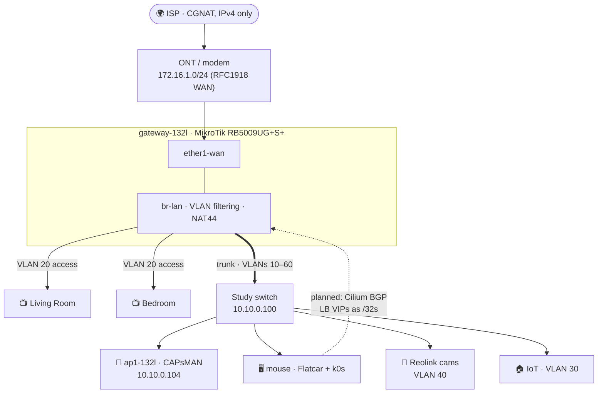
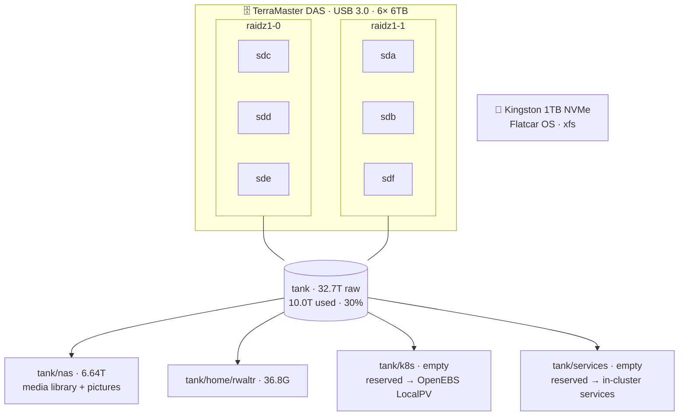

<div align="center">


# home-ops

### _Flatcar · k0s · Cilium — GitOps homelab, cloud-managed with Terraform/Pulumi_

[](https://discord.gg/k8s-at-home)
[](https://github.com/pre-commit/pre-commit)
[](https://github.com/rwaltr/home-ops/commits/master)
[](https://github.com/rwaltr/home-ops/stargazers)
[](https://k0sproject.io/)

</div>

## 📖 Overview

Monorepo for my personal homelab. The main host (**mouse**) runs Flatcar Container Linux (immutable OS) with a single-node k0s + Cilium cluster; cloud resources are managed with Terraform (migrating to Pulumi). Services include object storage (RustFS), monitoring (Netdata), and backups (Backblaze B2).

> 🗺️ Migration plan, decisions log, and lessons: **[REFACTOR_PLANS.md](REFACTOR_PLANS.md)**

```
Flatcar (ZFS sysext) → k0sctl/k0s → Cilium (BGP) → Envoy Gateway → Flux
```

## 🗂️ Repository Structure

| Path               | Purpose                                                      |
| ------------------ | ------------------------------------------------------------ |
| `infra/flatcar/`   | Butane → Ignition host configs (`base.bu` + per-host)        |
| `infra/k0s/`       | k0sctl cluster definitions                                   |
| `infra/terraform/` | Cloudflare, Backblaze B2, Terraform Cloud (maintenance mode) |
| `infra/shared/`    | Shared SOPS-encrypted config                                 |
| `.mise/tasks/`     | Task automation (flatcar VM lifecycle, terraform)            |

## 🔧 Infrastructure

### 🚗 Flatcar

Immutable, container-first host OS configured in `infra/flatcar/` via Butane → Ignition. A shared `base.bu` (users, Tailscale, mDNS, update policy) merges into per-host configs. ZFS comes from the official systemd-sysext; the tank pool is created by hand and **imported** by Ignition.

Raw qemu test VMs (no libvirt) validate every config end-to-end. Tasks take a host argument (`test` = scratch VM, `mouse` = mirrors production):

```bash
mise run flatcar:bootstrap mouse  # full env: boot → seed tank → verify → k0s + Cilium + nginx
mise run flatcar:vm test          # build ignition, download image, boot VM
mise run flatcar:verify test      # verify ZFS sysext, pool, VLAN over SSH
mise run flatcar:k0s test         # install k0s + Cilium, nginx smoke test
mise run flatcar:seed mouse       # hand-create tank like bare metal, then reboot
mise run flatcar:clean test       # destroy VM and disks
```

### ☸️ Kubernetes (k0s)

Single-node k0s cluster on mouse (v1.36, Cilium as kube-proxy replacement), managed via k0sctl configs in `infra/k0s/`. GitOps layout (Flux + helmfile bootstrap, modeled on [onedr0p/home-ops](https://github.com/onedr0p/home-ops)) is the next migration phase.

### 🌐 Terraform

Cloud resources in maintenance mode — migrating to Pulumi:

- **Cloudflare** — DNS and domain management (`infra/terraform/cloudflare/`)
- **Backblaze B2** — backup storage provisioning (`infra/terraform/backblaze/`)
- **Terraform Cloud** — workspace management (`infra/terraform/tf-cloud/`)

### 🚀 Pulumi

Planned migration target for cloud resources (Go). Early stubs were pruned; `infra/pulumi/` will be recreated when this migration becomes active.

### 🔐 SOPS

Age-based secrets management — sensitive values are encrypted inline alongside repository files.

## 🖥️ Current Host

**mouse** (Flatcar) — primary infrastructure host:

| Role           | Details                                   |
| -------------- | ----------------------------------------- |
| Storage        | ZFS tank pool (raidz1×2, `/var/tank`)     |
| Kubernetes     | single-node k0s + Cilium                  |
| Object Storage | RustFS (S3-compatible, moving in-cluster) |
| Monitoring     | Netdata (moving in-cluster)               |
| Access         | Tailscale + mDNS (`mouse.local`)          |

Config: `infra/flatcar/butane/hosts/mouse.bu`

## 🌐 Networking

<details>
  <summary>Click here to see the high-level network diagram</summary>



</details>

The network is segmented into six VLANs on a single bridge (`br-lan`, vlan-filtering).
The ISP is behind **CGNAT** — the WAN is a private 172.16.1.0/24 with no inbound
v4, so external access is via Tailscale. IPv6 is **ULA-only**
(`fdad:207a:f1ab::/48`, one /64 per VLAN matching its ID, SLAAC) — the ISP
delegates no prefix, so v6 stays internal. The router is `.1` / `::1` on every
segment.

| VLAN | Name      | IPv4         | IPv6 (ULA)             | DHCP/RA | Purpose                        |
| ---- | --------- | ------------ | ---------------------- | ------- | ------------------------------ |
| 10   | mgmt      | 10.10.0.0/24 | fdad:207a:f1ab:10::/64 | ✔      | Network gear + `mouse` host    |
| 20   | clients   | 10.20.0.0/24 | fdad:207a:f1ab:20::/64 | ✔      | TVs, phones, laptops           |
| 30   | iot       | 10.30.0.0/23 | fdad:207a:f1ab:30::/64 | ✔      | Appliances and robots          |
| 40   | cameras   | 10.40.0.0/24 | fdad:207a:f1ab:40::/64 | ✔      | Reolink cameras                |
| 50   | servers   | 10.50.0.0/24 | fdad:207a:f1ab:50::/64 | ✖      | Cluster services / Cilium VIPs |
| 60   | untrusted | 10.60.0.0/24 | fdad:207a:f1ab:60::/64 | ✔      | Guest — upstream DNS only      |

VLAN 50 gets no DHCPv4 and no router advertisements by design — addressing there
is static, reserved for the k0s cluster where Cilium will announce LoadBalancer
VIPs to the router over BGP (see [REFACTOR_PLANS.md](REFACTOR_PLANS.md)). The
router recurses DNS to Quad9/Cloudflare and repeats mDNS between clients, IoT,
and servers. A link-local rescue port lives on `ether8-oob` (`fe80::1`).

## 💾 Storage

<details>
  <summary>Click here to see the storage layout</summary>



</details>

All data lives on `tank` — two 3-wide raidz1 vdevs across six 6TB drives in a
USB-attached TerraMaster DAS (each disk on its own ASMedia SATA bridge). The
Flatcar OS runs on a separate 1TB NVMe. Every dataset uses lz4 compression with
`atime=off` and `xattr=sa`.

| Dataset           | Mountpoint             | Used  | Purpose                          |
| ----------------- | ---------------------- | ----- | -------------------------------- |
| tank              | /var/tank              | 6.69T | Pool root                        |
| tank/nas/library  | /var/tank/nas/library  | 6.63T | Media, games, books, music       |
| tank/nas/pictures | /var/tank/nas/pictures | 14.4G | Photo library                    |
| tank/home/rwaltr  | /var/tank/home/rwaltr  | 36.8G | Home directory                   |
| tank/k8s          | /var/tank/k8s          | —     | Reserved for OpenEBS ZFS LocalPV |
| tank/services     | /var/tank/services     | —     | Reserved for in-cluster services |

Pool health is automated with a monthly scrub timer and `zfs-zed` for events.
Backups are kopiur-style snapshots to RustFS (S3) once the cluster lands — see
[REFACTOR_PLANS.md](REFACTOR_PLANS.md).

## ☁️ Cloud Integrations

- **Cloudflare** — DNS and domain management (familylegacy, legacy, prof, public zones)
- **Backblaze B2** — S3-compatible backup storage for long-term retention

## 🧰 Tools

| Tool       | Use                          | Status           |
| ---------- | ---------------------------- | ---------------- |
| Flatcar    | Operating System             | ✅               |
| k0s        | Kubernetes (single-node)     | ✅               |
| Cilium     | CNI (kube-proxy replacement) | ✅               |
| ZFS        | Storage & Snapshots          | ✅               |
| SOPS       | Secrets Management           | ✅               |
| Terraform  | Cloud Resource Management    | ✅ (maintenance) |
| Pulumi     | Cloud Resource Management    | 🚧 planned       |
| RustFS     | S3-compatible Storage        | ✅               |
| Netdata    | System Monitoring            | ✅               |
| mise       | Task Runner & Tool Mgmt      | ✅               |
| Pre-commit | Code Quality Automation      | ✅               |

## 🖊️ TODOs

In-code TODOs use the `TODO:` format — [search the repo](https://github.com/rwaltr/home-ops/search?q=TODO%3A).

---

<div align="center">

**🤟 Thanks** — [onedr0p](https://github.com/onedr0p) · [anthr76](https://github.com/anthr76) · [danmanners](https://github.com/danmanners) for inspiration
**🌐 Community** — [k8s-at-home Discord](https://discord.gg/k8s-at-home)
**📬 Contact** — GitHub Issues · Email
**📜 Changelog** — [commit history](https://github.com/rwaltr/home-ops/commits/master)

</div>
